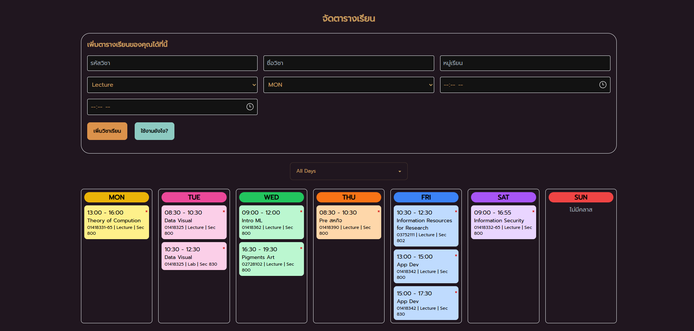

# Time Table Management

If you have a problem when you need to plan your enrollment in each subject. It can show the schedule clearly easy to manage. You can see your overview of your table before enroll.



--- 

# Feature
- **Quick Copy** : Just Click on the block it will copy subject ID , It make you faster than the other when you in register time
- **Easy Input** : Input a subject information through the form and add it to table easily
- **Filter** : If you want to see in separate day. I have a day filter for you 

---

# Tech
- React JS
- Tailwind CSS
- Vite

---

# Plan 
- [ ] **Personal Account** : I will make an account to store personal table
- [ ] **More Easy input** : I will make a form more easier to input

---
# How to install
1. **Clone the project**
```bash
git clone https://github.com/NutNaphop/Time-Table-Management.git
cd Time-Table-Management
```

2. **Install dependencies**
```bash
npm install 
```

3. **Run Server**
```bash
npm run dev
```

---
